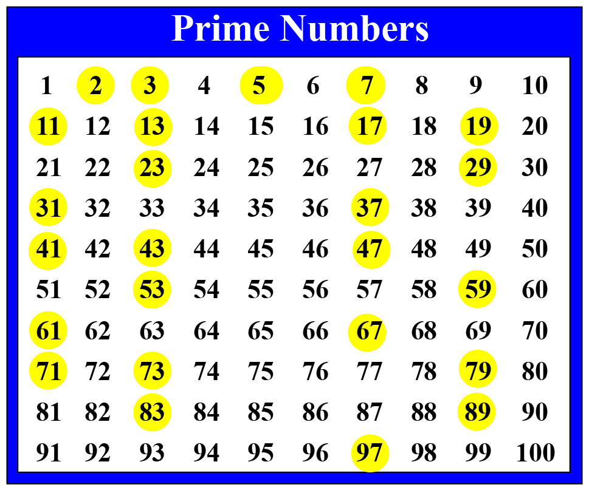

### Prime Number Check

# Instruction

Prime numbers are the numbers that are divisible by **_` itself`_** or **_`1`_**

https://en.wikipedia.org/wiki/Prime_number

**_`You need to write a function`_** that will check weather number is prime or not prime.

Here is list image of prime numbers highlighted in yellow are prime numbers

# Example Input

13

# Example Output

13 is a prime number

# Example Input

35

# Example Output

35 is NOT a prime number
